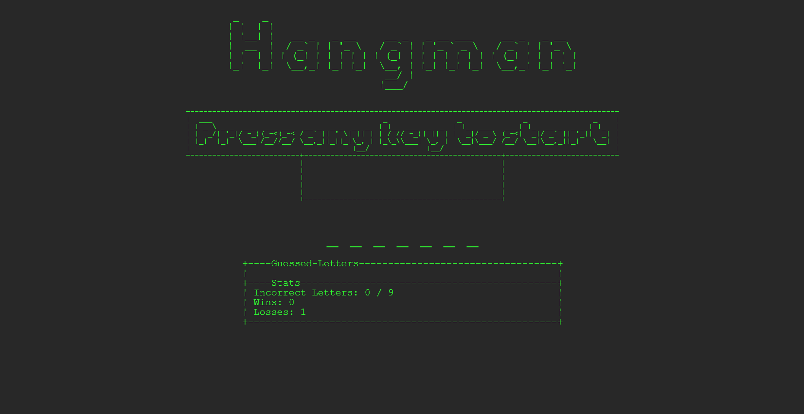

## Project 2
Purpose of the project:

Gain experience using git via your CLI and Visual Studio Code (VSCode) Source Control

Gain experience writing and executing non-web server Node.js JavaScript code

Practice refactoring JavaScript code

Technologies used for the project:

command line interface, VSCode, Node.js

What I learned from the project:

I learned about source control involved with functions and tools to use within VSCode to ignore and differencetiate files, and reefactoring.  

